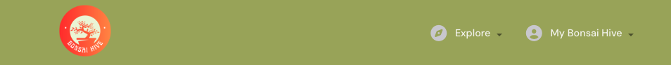

# bonsaiHive (REACT UI)

[bonsaiHive](https://bonsaihive-react-dbe9685329cb.herokuapp.com/) is a dedicated community platform connecting bonsai enthusiasts across West Sussex.

Unlike general gardening forums or broad social networks, Bonsai Hive is specifically designed for the art and passion of bonsai — offering a focused, vibrant space where knowledge, creativity, and local connection thrive.

Bonsai lovers are encouraged to:

- Share photos of their bonsai trees,

- Exchange care tips and cultivation techniques,

- Discover and explore different bonsai styles,

- Follow and interact with fellow bonsai artists,

- Join local meetups and community events,

- Build a supportive and engaged bonsai network.

Only registered users can access the platform’s content — including posts, photos, tips, and profiles. Signing up unlocks full access to these community features.

The goal of this React-based user interface is to deliver an engaging, intuitive front-end experience that enables users to create, read, update, and delete bonsai-related content by interacting seamlessly with the [back-end API](heroku/admin yaz). This ensures a dynamic and user-friendly platform for growing both bonsai knowledge and community connections.

Whether you're just starting out or are a seasoned bonsai grower, bonsaiHive is the ideal place to grow your trees — and your network.

(https://ui.dev/amiresponsive-eklenecek)

## Contents

- [Design](#design)

  - [Colour Scheme](#colour-scheme)
  - [Typography](#typography)
  - [Wireframes](#wireframes)

- [User Experience (UX)](#user-experience-ux)

  - [Site Purpose](#site-purpose)
  - [Site Goal](#site-goal)
  - [Audience](#audience)
  - [Communication](#communication)
  - [Current User Goals](#current-user-goals)
  - [New User Goals](#new-user-goals)
  - [Future Goals](#future-goals)

- [User Stories](#user-stories)
- [Features](#features)
  - [Navigation Bar](#navigation-bar)
    - [Navigation Bar (logged in)](#navigation-bar-logged-in)
    - [Navigation Bar (Admin)](#navigation-bar-admin-user)
  - [Footer](#footer)
  - [Home Page](#home-page)
  - [About Page](#about-page)
  - [Contact us Page](#contact-page)
  - [Listings Page](#listings-page)
  - [Listing Page](#listing-page)
    - [Images modal](#images-modal)
  - [Add Listing Page](#add-listing-page)
  - [Edit Listing Page](#edit-listing-page)
  - [Messages Page](#messages-page)
    - [Message Page](#message-page)
  - [Sign in Page](#sign-in-page)
  - [Signup Page](#sign-up-page)
  - [Wishlist Page](#wishlist-page)
  - [Profile Page](#profile-page)
    - [Edit Profile](#edit-profile-page)
    - [Change username](#change-username-page)
    - [Change password](#change-password-page)
  - [403 error Page](#403-error-page)
  - [404 error Page](#404-error-page)
- [Reusable Components](#reusable-components)
- [Technologies Used](#technologies-used)
  - [Languages Used](#languages-used)
  - [Frameworks, Libraries & Programs Used](#frameworks-libraries--programs-used)
- [Deployment and Local Development](#deployment-and-local-development)
  - [Local Development](#local-development)
    - [How to fork](#how-to-fork)
    - [How to clone](#how-to-clone)
    - [Deployment](#deployment)
- [Testing](#testing)
- [Credits](#credits)

## Design

### Colour Scheme

- The colour palette of Bonsai Hive is inspired by nature and the calming tones often found in bonsai environments. The goal was to create a warm, earthy feel that reflects the peaceful and organic spirit of bonsai art.
  - #385212 – Deep olive green used as the main background colour. Evokes the richness of soil and deep foliage.
  - #A2AD63 – Muted green-yellow used for navigation bars and buttons. Bright enough for attention, but still grounded in nature.
  - #e7e0ca – Soft cream tone used for card backgrounds. Adds warmth and improves readability against darker tones.
  - #d9cba3 – Pale golden beige used in card highlights and accents. Suggests natural light and subtle detail.
- While these colours were consistently used across the site, minor variations and adjustments were made where needed to maintain visual harmony and contrast.

### Typography

- A system font stack was used to ensure fast loading and consistent rendering across different devices and platforms.

  - The primary font stack includes:

    - apple-system, BlinkMacSystemFont, 'Segoe UI', 'Roboto', 'Oxygen', 'Ubuntu', 'Cantarell', 'Fira Sans', 'Droid Sans', 'Helvetica Neue', sans-serif

  - This approach ensures that the application looks clean and modern while minimizing dependency on external font files.

- For code elements, a monospaced font stack is used:

  - source-code-pro, Menlo, Monaco, Consolas, 'Courier New', monospace

  - This improves readability in code blocks and form inputs where fixed-width fonts are appropriate.

- Icons

  - Consistent use of Font Awesome icons and colours enhances the user experience across the application.

  - Key icons include:
    - Add Post: far fa-plus-square
    - Search: fas fa-search
    - Options/Menu: fas fa-ellipsis-v
    - Edit (including profile editing): fas fa-edit
    - Delete: fas fa-trash-alt
    - User-related icons such as:
      - My Bonsai Hive: fas fa-user-circle
      - My Profile: fas fa-user
      - Sign In: fas fa-sign-in-alt
      - Sign Out: fas fa-sign-out-alt
      - Sign Up: fas fa-user-plus
  - Navigation and content-related icons:
    - Explore: fas fa-compass
    - Posts: fas fa-seedling
    - Liked: fas fa-heart
    - Events: fas fa-calendar-alt
    - Reviews: fas fa-star
    - Contact: fas fa-envelope
  - Security and identity icons:
    - ID Card: far fa-id-card
    - Key: fas fa-key

- All icons are sourced from the free [Font Awesome](https://fontawesome.com/) library and used consistently to represent their respective functions throughout the site.

### Wireframes

#### Desktop

These views are only visible to users who are logged in.

[Posts Page](docs/readme-images/Posts_page.png)

[Feed Page](docs/readme-images/Feed_page.png)

[Liked page](docs/readme-images/Liked_page.png)

[Events Page](docs/readme-images/Events_page.png)

[My Profile Page](docs/readme-images/my_profile_page.png)

These views are only visible to users who are not logged in.

[Home Page](docs/readme-images/Home_page.png)

[Sign in](docs/readme-images/Signin_page.png)

[Signup](docs/readme-images/Signup_page.png)

These views are visible to all users whether logged in or not.

[Reviews Page](docs/readme-images/Reviews_page.png)

[Contact](docs/readme-images/Contact_page.png)

#### Mobile

These views are only visible to users who are logged in.

[Posts Page](docs/readme-images/mobile_posts_page.png)

[Feed Page](docs/readme-images/mobile_feed_page.png)

[Liked page](docs/readme-images/mobile_liked_page.png)

[Events Page](docs/readme-images/mobile_events_page.png)

[My Profile Page](docs/readme-images/mobile_my_profile_page.png)

These views are only visible to users who are not logged in.

[Home Page](docs/readme-images/mobile_home_page.png)

[Sign in](docs/readme-images/mobile_signin_page.png)

[Signup](docs/readme-images/mobile_signup_page.png)

These views are visible to all users whether logged in or not.

[Reviews Page](docs/readme-images/mobile_reviews_page.png)

[Contact](docs/readme-images/mobile_contact_page.png)

## User Experience (UX)

### Site Purpose

bonsaiHive is a dedicated community platform connecting bonsai enthusiasts across West Sussex. Unlike general gardening forums or broad social networks, it offers a focused and vibrant space where bonsai knowledge, creativity, and local connections thrive. The site’s purpose is to make sharing, learning, and engaging around bonsai art seamless and rewarding.

### Site Goal

The overarching goal of bonsaiHive is to become a trusted and engaging digital hub for bonsai lovers. By fostering interaction and knowledge exchange, the platform strives to strengthen both the practice of bonsai cultivation and the bonds within the local community.

### Audience

The target audience includes bonsai enthusiasts of all levels — from beginners taking their first steps into the art, to experienced growers and collectors. Additionally, the site appeals to individuals seeking local meetups, workshops, and community-driven events.

### Communication

- Current Communication

bonsaiHive communicates through user-generated posts, photos, care tips, and profiles. Its intuitive interface encourages members to actively share and explore content while keeping information clear and visually engaging. For direct inquiries or support, users can reach out to the admin via the Contact Us form, ensuring an open and accessible communication channel with the platform.

- Future Communication

As the platform evolves, bonsaiHive may introduce additional communication features such as in-platform notifications, event reminders, or direct messaging between members. These enhancements would further strengthen engagement and connectivity within the community.

### Current User Goals

- Existing users on bonsaiHive aim to:

- Share photos of their bonsai trees,

- Exchange care tips and cultivation techniques,

- Discover and explore different bonsai styles,

- Follow and interact with fellow bonsai artists,

- Stay informed about local meetups and events.

### New User Goals

New users should be able to:

- Sign up easily and access community features,

- Quickly understand how to share posts, comment, and follow others,

- Make their first contribution (e.g., posting a bonsai photo),

- Start connecting with local bonsai enthusiasts.

### Future Goals

Looking ahead, bonsaiHive plans to:

- Integrate more local event features,

- Expand search and discovery tools for posts and users,

- Add structured bonsai care guides and style libraries,

- Enhance the mobile experience,

- Grow beyond West Sussex to connect bonsai communities in other regions.

XXXXXXXXXXXXXXXXXXXXXXXX

## Features

### Reusable React Components

This project follows a modular structure by creating and reusing React components to efficiently build the front-end. Below is an overview of reusable components and site-wide features, including their descriptions and how they are utilized throughout the application.

### Visual Identity

**Logo & Favicon (site-wide)**

- The application uses a single custom-designed image as both the logo and favicon.

- This image features a stylized bonsai tree created in Canva, incorporating the colour palette: #eff6dd, #fab297, #ff8249, #ff6540, and #ff4536.

- The favicon was generated from this logo using [favicon](https://favicon.io/) to ensure compatibility across browsers and devices.

- This consistent branding is applied throughout the site, including the navbar, browser tabs, and other key areas.

**Navigation Bar (components/NavBar.js)**

The navigation bar features the Bonsai Hive logo with a natural green background (#A2AD63), providing clear and consistent branding across the site. Navigation links are styled in a light cream color (#F5F5F0) by default, switching to a pale gold (#D9CBA3) when active or hovered, improving visual feedback.

Links are tailored based on user authentication status:

Logged-out users see links to Reviews, Contact, Sign in, and Sign up pages.

Logged-in users have access to dropdown menus for Explore (Posts, Feed, Liked, Events) and My Bonsai Hive (My Profile, Reviews, Contact, Sign out).

The navbar is fully responsive, collapsing navigation links into a hamburger menu on smaller screens (<768px) with consistent background and styled dropdown items for a clean, user-friendly interface.

Usage:
Used throughout the entire application, fixed at the top with a height of 108px to ensure easy and consistent access.

- **Logged Out Links**

The links visible to users who are not signed in include:

- Reviews — Access the reviews page to see user feedback.
- Contact — Navigate to the contact form for inquiries.
- Sign In — Link to the login page for existing users.
- Sign Up — Link to the registration page for new users.

 Navbar Screenshot Unauthorised (Desktop) 

- **Logged In Links**

The links that are visible to authenticated users when logged in are:

- Explore

  - Posts – Browse all public posts.
  - Feed – View content from users you follow.
  - Liked – See posts you’ve liked.
  - Events – Discover upcoming community events.

- My Bonsai Hive

  - My Profile – View and edit your user profile and posts.
  - Reviews – Manage or view reviews you’ve written or received.
  - Contact – Get in touch with support or leave feedback.
  - Sign Out – Log out of your account.

   
  

  
 Navbar Screenshot Authorised (Desktop) 

  

### Home

- Presents an easy-to-understand landing page to welcome new and returning users, describing the site's fundamental objectives and motivating them to join by registering or checking out the general feed.

 

 Home Page Screenshot (Desktop) 

 Home Page Screenshot (Mobile) 

 
 

### Feed

The feed offers users a convenient way to browse through multiple posts displayed in a simple, scrollable list. On the bonsaiHive page, this feed specifically shows posts from users they follow.

- Users can filter content based on their preferences:
  - The Feed on bonsaiHive displays updates only from followed users,
  - While the Posts section contains posts from all users site-wide.

This separation makes it easy for users to find the content they want.

Additionally, the feed implements infinite scrolling, meaning new posts load automatically as the user scrolls down. This eliminates the need for pagination controls, providing a smooth and modern browsing experience.

 

 Feed Screenshot (Desktop) 

 

 Feed Screenshot (Mobile) 

 
 

### Future Features

There are several features that would further improve this application. With more time and resources, I would like to implement:

- Google Maps integration for events — Allowing users to easily locate event venues on a map.
- Filtering posts by categories or tags — Enabling users to sort and view posts based on their interests.
- User nomination system — Allowing users to nominate new events or topics to be added.
- Improved event management — Features such as RSVP, reminders, and calendar syncing.

### Other Features

- **Responsive Design**

  - The site is built with a mobile-first approach, ensuring a seamless and intuitive user experience across all devices, including desktops, tablets, and smartphones.

- **Infinite Scrolling**

  - Users can effortlessly browse posts and comments without manual pagination, as new content loads automatically while scrolling for a smooth and continuous experience.

- **Real-time Updates**

  - Comments and likes on posts update instantly, allowing users to see interactions live and stay engaged with the community.

- **Security**

  - User authentication and data handling are secured with strong encryption and best practices to protect user privacy and sensitive information.

- **Accessibility**
  - The application is designed to be inclusive, following accessibility standards such as screen reader compatibility and providing alternative text for images to support all users.

## Design Process

- The full process for planning and setting up the project is outlined in the README for the [bonsaiHive REST API](https://github.com/techistem/bonsaiHive_P5)

### User Stories

- At the beginning of the project, user stories were outlined to define the core functionality from the user's perspective. These user stories were grouped under five key EPICs and developed iteratively.

- The initial planning was done using a spreadsheet where each user story was mapped to its corresponding EPIC and broken down into technical tasks.

- All user stories can be viewed in the user-stories pdf version of the spreadsheet

# Agile Methodology

## Overview

An agile methodology was used to develop this project, using iterations on a kanban board.
GitHub projects was used to facilitate the agile development:
<a href="https://github.com/users/techistem/projects/20/views/1" target="_blank">bonsaihive-react Project</a>

 

## Specific Implementation and Breakdown of Themes

To ensure structured, user-centered development, the project was organized into five main EPICs, each representing a key user experience area. These EPICs were broken down into detailed User Stories, which were managed on a GitHub Kanban board with columns for To Do, In Progress, and Done. Development progressed iteratively, following Agile principles and utilizing the MoSCoW prioritization method (Must Have, Should Have, Could Have, Won’t Have).

The five EPICs and their focus areas are as follows:

1. Navigation & Authentication
   Users can securely sign up, log in, and navigate the site.

Conditional navigation is implemented (e.g., NavBar updates based on login status).

Features include routing, avatar display, and token refresh for session handling.

2. Posts – Create, View & Interact
   Users can create new posts, view individual posts, and engage by liking them.

This encourages user participation and content sharing.

3. Posts Page – Discovery & Browsing
   Users can explore content using filters such as recent posts, liked posts, and posts from followed users.

Infinite scrolling is implemented to enhance content discovery and browsing experience.

4. Post Page – Detail & Comments
   Users can view detailed post content and interact through comments.

Commenting includes creating, editing, deleting, and viewing timestamped feedback.

5. Profile Page – Users & Relationships
   Users can manage their profiles, update credentials, and track activity.

Features include viewing other users’ profiles, following/unfollowing, and viewing user stats (such as most followed).
