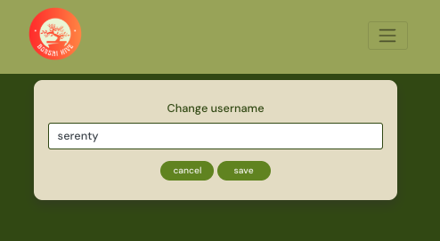

# bonsaiHive (REACT UI)

[bonsaiHive](https://bonsaihive-react-dbe9685329cb.herokuapp.com/) is a dedicated community platform connecting bonsai enthusiasts across West Sussex.

Unlike general gardening forums or broad social networks, Bonsai Hive is specifically designed for the art and passion of bonsai — offering a focused, vibrant space where knowledge, creativity, and local connection thrive.

Bonsai lovers are encouraged to:

- Share photos of their bonsai trees,

- Exchange care tips and cultivation techniques,

- Discover and explore different bonsai styles,

- Follow and interact with fellow bonsai artists,

- Join local meetups and community events,

- Build a supportive and engaged bonsai network.

Only registered users can access the platform’s content — including posts, photos, tips, and profiles. Signing up unlocks full access to these community features.

The goal of this React-based user interface is to deliver an engaging, intuitive front-end experience that enables users to create, read, update, and delete bonsai-related content by interacting seamlessly with the [back-end API](heroku/admin yaz). This ensures a dynamic and user-friendly platform for growing both bonsai knowledge and community connections.

Whether you're just starting out or are a seasoned bonsai grower, bonsaiHive is the ideal place to grow your trees — and your network.


## Contents

- [Design](#design)

  - [Colour Scheme](#colour-scheme)
  - [Typography](#typography)
  - [Wireframes](#wireframes)

- [User Experience (UX)](#user-experience-ux)

  - [Site Purpose](#site-purpose)
  - [Site Goal](#site-goal)
  - [Audience](#audience)
  - [Communication](#communication)
  - [Current User Goals](#current-user-goals)
  - [New User Goals](#new-user-goals)
  - [Future Goals](#future-goals)

- [User Stories](#user-stories)
- [Agile Methodology](#agile-methodology)
- [Data](#data)
- [Features](#features)

  - [Logo and Favicon](#logo-and-favicon)
  - [Navigation Bar](#navigation-bar)
  - [Home Page](#home-page)
  - [Posts Page](#posts-page)
  - [Comments](#comments)
  - [Feed](#feed)
  - [Likes](#likes)
  - [Events](#events)
  - [My Profile Page](#my-profile-page)
    - [Edit Profile](#edit-profile-page)
    - [Change username](#change-username)
    - [Change password](#change-password)
  - [Reviews](#reviews)
  - [Contact](#contact)
  - [Future Features](#future-features)
  - [Other Features](#other-features)

- [Reusable Components](#reusable-components)
- [Technologies Used](#technologies-used)
  - [Languages Used](#languages-used)
  - [Frameworks, Libraries & Programs Used](#frameworks-libraries--programs-used)
- [Deployment and Local Development](#deployment-and-local-development)
  - [Local Development](#local-development)
    - [How to fork](#how-to-fork)
    - [How to clone](#how-to-clone)
    - [Deployment](#deployment)
- [Testing](#testing)
- [Credits](#credits)

## Design

### Colour Scheme

- The colour palette of Bonsai Hive is inspired by nature and the calming tones often found in bonsai environments. The goal was to create a warm, earthy feel that reflects the peaceful and organic spirit of bonsai art.
  - #385212 – Deep olive green used as the main background colour. Evokes the richness of soil and deep foliage.
  - #A2AD63 – Muted green-yellow used for navigation bars and buttons. Bright enough for attention, but still grounded in nature.
  - #e7e0ca – Soft cream tone used for card backgrounds. Adds warmth and improves readability against darker tones.
  - #d9cba3 – Pale golden beige used in card highlights and accents. Suggests natural light and subtle detail.
- While these colours were consistently used across the site, minor variations and adjustments were made where needed to maintain visual harmony and contrast.


### Typography

- A system font stack was used to ensure fast loading and consistent rendering across different devices and platforms.

  - The primary font stack includes:

    - apple-system, BlinkMacSystemFont, 'Segoe UI', 'Roboto', 'Oxygen', 'Ubuntu', 'Cantarell', 'Fira Sans', 'Droid Sans', 'Helvetica Neue', sans-serif

  - This approach ensures that the application looks clean and modern while minimizing dependency on external font files.

- For code elements, a monospaced font stack is used:

  - source-code-pro, Menlo, Monaco, Consolas, 'Courier New', monospace

  - This improves readability in code blocks and form inputs where fixed-width fonts are appropriate.

- Icons

  - Consistent use of Font Awesome icons and colours enhances the user experience across the application.

  - Key icons include:
    - Add Post: far fa-plus-square
    - Search: fas fa-search
    - Options/Menu: fas fa-ellipsis-v
    - Edit (including profile editing): fas fa-edit
    - Delete: fas fa-trash-alt
    - User-related icons such as:
      - My Bonsai Hive: fas fa-user-circle
      - My Profile: fas fa-user
      - Sign In: fas fa-sign-in-alt
      - Sign Out: fas fa-sign-out-alt
      - Sign Up: fas fa-user-plus
  - Navigation and content-related icons:
    - Explore: fas fa-compass
    - Posts: fas fa-seedling
    - Liked: fas fa-heart
    - Events: fas fa-calendar-alt
    - Reviews: fas fa-star
    - Contact: fas fa-envelope
  - Security and identity icons:
    - ID Card: far fa-id-card
    - Key: fas fa-key

- All icons are sourced from the free [Font Awesome](https://fontawesome.com/) library and used consistently to represent their respective functions throughout the site.

### Wireframes

#### Desktop

These views are only visible to users who are logged in.

[Posts Page](docs/readme-images/Posts_page.png)

[Feed Page](docs/readme-images/Feed_page.png)

[Liked page](docs/readme-images/Liked_page.png)

[Events Page](docs/readme-images/Events_page.png)

[My Profile Page](docs/readme-images/my_profile_page.png)

These views are only visible to users who are not logged in.

[Home Page](docs/readme-images/Home_page.png)

[Sign in](docs/readme-images/Signin_page.png)

[Signup](docs/readme-images/Signup_page.png)

These views are visible to all users whether logged in or not.

[Reviews Page](docs/readme-images/Reviews_page.png)

[Contact](docs/readme-images/Contact_page.png)

#### Mobile

These views are only visible to users who are logged in.

[Posts Page](docs/readme-images/mobile_posts_page.png)

[Feed Page](docs/readme-images/mobile_feed_page.png)

[Liked page](docs/readme-images/mobile_liked_page.png)

[Events Page](docs/readme-images/mobile_events_page.png)

[My Profile Page](docs/readme-images/mobile_my_profile_page.png)

These views are only visible to users who are not logged in.

[Home Page](docs/readme-images/mobile_home_page.png)

[Sign in](docs/readme-images/mobile_signin_page.png)

[Signup](docs/readme-images/mobile_signup_page.png)

These views are visible to all users whether logged in or not.

[Reviews Page](docs/readme-images/mobile_reviews_page.png)

[Contact](docs/readme-images/mobile_contact_page.png)

## User Experience (UX)

### Site Purpose

bonsaiHive is a dedicated community platform connecting bonsai enthusiasts across West Sussex. Unlike general gardening forums or broad social networks, it offers a focused and vibrant space where bonsai knowledge, creativity, and local connections thrive. The site’s purpose is to make sharing, learning, and engaging around bonsai art seamless and rewarding.

### Site Goal

The overarching goal of bonsaiHive is to become a trusted and engaging digital hub for bonsai lovers. By fostering interaction and knowledge exchange, the platform strives to strengthen both the practice of bonsai cultivation and the bonds within the local community.

### Audience

The target audience includes bonsai enthusiasts of all levels — from beginners taking their first steps into the art, to experienced growers and collectors. Additionally, the site appeals to individuals seeking local meetups, workshops, and community-driven events.

### Communication

- Current Communication

bonsaiHive communicates through user-generated posts, photos, care tips, and profiles. Its intuitive interface encourages members to actively share and explore content while keeping information clear and visually engaging. For direct inquiries or support, users can reach out to the admin via the Contact Us form, ensuring an open and accessible communication channel with the platform.

- Future Communication

As the platform evolves, bonsaiHive may introduce additional communication features such as in-platform notifications, event reminders, or direct messaging between members. These enhancements would further strengthen engagement and connectivity within the community.

### Current User Goals

- Existing users on bonsaiHive aim to:

- Share photos of their bonsai trees,

- Exchange care tips and cultivation techniques,

- Discover and explore different bonsai styles,

- Follow and interact with fellow bonsai artists,

- Stay informed about local meetups and events.

### New User Goals

New users should be able to:

- Sign up easily and access community features,

- Quickly understand how to share posts, comment, and follow others,

- Make their first contribution (e.g., posting a bonsai photo),

- Start connecting with local bonsai enthusiasts.

### Future Goals

Looking ahead, bonsaiHive plans to:

- Integrate more local event features,

- Expand search and discovery tools for posts and users,

- Add structured bonsai care guides and style libraries,

- Enhance the mobile experience,

- Grow beyond West Sussex to connect bonsai communities in other regions.

## User Stories

One of the first tasks was to map out user stories for the project which could be mapped against EPICS and broken down into tasks. These were initially worked through in an excel spreadsheet and worked into a rough working order based on the Moments walkthrough project build.


## Agile Methodology

Following the principles outlined in the Code Institute Agile Working units, I created a GitHub Kanban Board and, using Project Issues, Milestones, and Labels, mapped out the bonsaiHive user stories into the following categories:

- **EPICS**: Overarching blocks of work broken down into USER STORY issues
- **To Do**: USER STORY issues with acceptance criteria and tasks
- **In Progress**: USER STORY issues currently in progress during each Milestone or 'Sprint'
- **Completed**: USER STORY issues that have been completed
- **BUGS**: BUG issues that define a particular problem encountered during the project and how it was resolved


You can view the ongoing work through the [GitHub Issues](https://github.com/techistem/bonsaihive-react/issues) for this project, as well as the [KANBAN board](https://github.com/users/techistem/projects/20).

## Data

**_Models_**

- The next step was to plan and devise an ERD for each of my database models and a schema to map out and understand the relationships between them. I created an ERD and model schema for the project and the data structured required for the UI to work.

You can view all ERDs and the full schema in the [back-end bonsaiHive API](https://github.com/techistem/bonsaiHive_P5) README.

**_User Authentication_**

Throughout the site, conditional rendering and fetchData filtering methods are used to ensure that the content rendered is accordant with the authentication profile for that user.

There are three main user authentication levels:

- **Casual User**
  - Any user who visits the site and is not logged in.
- **Authenticated User**
  - A user who has signed up to the site and successfully logged in.
- **Authenticated Admin**
  - An authenticated user who has been given is_staff status in the api admin dashboard (accessible by superusers only).

In addition to the above general authentication levels:

- **is_owner**
  - Checks if the current authenticated user is the owner of that particular instance. Conditional rendering is then used to display elements which are only accessible by the instance owner.

## Features

### Logo and Favicon

- The application uses a single custom-designed image as both the logo and favicon.

- This image features a stylized bonsai tree created in [Canva](https://www.canva.com/en_gb/), incorporating the colour palette: #eff6dd, #fab297, #ff8249, #ff6540, and #ff4536.

- The favicon was generated from this logo using [favicon](https://favicon.io/) to ensure compatibility across browsers and devices.

- This consistent branding is applied throughout the site, including the navbar, browser tabs, and other key areas.


### Navigation Bar

The navigation bar features the Bonsai Hive logo with a natural green background (#A2AD63), providing clear and consistent branding across the site. Navigation links are styled in a light cream color (#F5F5F0) by default, switching to a pale gold (#D9CBA3) when active or hovered, improving visual feedback.

Links are tailored based on user authentication status:

Logged-out users see links to Home, Reviews, Contact, Sign in, and Sign up pages.


Logged-in users have access to dropdown menus for Explore (Posts, Feed, Liked, Events) and My Bonsai Hive (My Profile, Reviews, Contact, Sign out).


The navbar is fully responsive, collapsing navigation links into a hamburger menu on smaller screens (<768px) with consistent background and styled dropdown items for a clean, user-friendly interface.


Usage:
Used throughout the entire application, fixed at the top with a height of 108px to ensure easy and consistent access.

The links visible to users who are not signed in include:

- Reviews — Access the reviews page to see user feedback.
- Contact — Navigate to the contact form for inquiries.
- Sign In — Link to the login page for existing users.
- Sign Up — Link to the registration page for new users.

<details>
<summary> Navbar Screenshot Unauthorised (Desktop) </summary>


</details>
<br/>

- **Logged In Links**

The links that are visible to authenticated users when logged in are:

- Explore

  - Posts – Browse all public posts.
  - Feed – View content from users you follow.
  - Liked – See posts you’ve liked.
  - Events – Discover upcoming community events.

<details>
  <summary>Navbar Screenshot Authorised (Desktop)</summary>


</details>

- My Bonsai Hive

  - My Profile – View and edit your user profile and posts.
  - Reviews – Manage or view reviews you’ve written or received.
  - Contact – Get in touch with support or leave feedback.
  - Sign Out – Log out of your account.

<details>
  <summary>Navbar Screenshot Authorised (Desktop)</summary>


</details>

### Home Page

- Presents an easy-to-understand landing page to welcome new and returning users, describing the site's fundamental objectives and motivating them to join by registering or checking out the general feed.

<details>
<summary> Home Page Screenshot (Desktop) </summary>


</details>
<details>
<summary> Home Page Screenshot (Mobile) </summary>


</details>

### Posts Page

The Posts page allows users to browse all content submitted by members of the bonsaiHive community. Posts are displayed in a **clean, scrollable list** that makes it easy to read and navigate.

- Users can explore content **from all users across the site**, not limited to the ones they follow.
- Each post shows key details such as author, content, likes, and interactions.

The page also features **infinite scrolling**, so new posts load automatically as the user scrolls down, providing a seamless browsing experience without pagination.

<details>
<summary>Posts Page Screenshot (Desktop)</summary>


</details>
<details>
<summary>Posts Page Screenshot (Mobile)</summary>


</details>

### Comments

### Comments

The Comments feature allows users to engage with posts by leaving feedback, questions, or starting discussions. Comments are displayed directly under each post in a **threaded format**, making it easy to follow conversations.

- Users can **add, edit, and delete** their own comments.
- Each comment displays the **author’s name, timestamp, and content**.
- Comments update dynamically, ensuring a smooth interaction without page reloads.

<details>
<summary>Comments Screenshot (Desktop)</summary>


</details>
<details>
<summary>Comments Screenshot (Mobile)</summary>


</details>

### Feed

The feed offers users a convenient way to browse through multiple posts displayed in a simple, scrollable list. On the bonsaiHive page, this feed specifically shows posts from users they follow.

- Users can filter content based on their preferences:
  - The Feed on bonsaiHive displays updates only from followed users,
  - While the Posts section contains posts from all users site-wide.

This separation makes it easy for users to find the content they want.

Additionally, the feed implements infinite scrolling, meaning new posts load automatically as the user scrolls down. This eliminates the need for pagination controls, providing a smooth and modern browsing experience.

<details>
<summary> Feed Screenshot (Desktop) </summary>


</details> 
<details>
<summary> Feed Screenshot (Mobile) </summary>


</details>

### Likes

The **Likes** page allows users to view all posts they have liked across the bonsaiHive platform. This feature makes it easy for users to revisit and engage with content they have previously appreciated.

- Displays a **personalized list** of posts that the user has liked
- Each liked post shows details such as **author, content, and total likes**
- Helps users **quickly find and re-engage** with their favorite content

<details>
<summary>Likes Page Screenshot (Desktop)</summary>


</details>
<details>
<summary>Likes Page Screenshot (Mobile)</summary>


</details>

### Events

The **Events** feature allows users to create and participate in community activities within bonsaiHive. This page helps members connect through shared interests such as workshops, discussions, and live sessions.

- Users can **create new events** by adding a title, description, date, and location
- A **clean, organized list** displays all upcoming events in chronological order
- Each event shows details such as **time, and location**
- Users can browse events to **stay updated and get involved** in the community

<details>
<summary>Events Page Screenshot (Desktop)</summary>


</details>
<details>
<summary>Events Page Screenshot (Mobile)</summary>


</details>

### My Profile Page

The **My Profile** page allows users to manage and personalize their bonsaiHive account. This section ensures that every member has control over their own information and community presence.

- Users can **update personal details** such as username, password, and profile picture
- Displays a summary of **user activity** (posts, likes, events)
- Allows browsing of **followers and following lists**

<details>
<summary>My Profile Page Screenshot (Desktop)</summary>


</details>

<details>
<summary>My Profile Page Screenshot (Mobile)</summary>


</details>

#### Edit Profile Page

<details>
<summary>Edit Profile Screenshot (Desktop)</summary>


</details>

<details>
<summary>Edit Profile Screenshot-2 (Desktop)</summary>


</details>

<details>
<summary>Edit Profile Screenshot-2 (Mobile)</summary>


</details>

#### Change username

<details>
<summary>Change Username Screenshot (Desktop)</summary>


</details>

<details>
<summary>Change Username Screenshot (Mobile)</summary>



</details>

#### Change Password

<details>
<summary>Change Password Screenshot (Desktop)</summary>


</details>

<details>
<summary>Change Password Screenshot (Mobile)</summary>


</details>

### Reviews

The **Reviews** page allows all visitors — whether signed in or not — to view general feedback about bonsaiHive. This feature provides transparency and helps showcase how the community values the platform.

- Displays **star ratings (1–5 stars)** given by users about the bonsaiHive platform
- Shows **general written reviews** that reflect the overall experience
- Both signed-in and signed-out users can **browse all reviews**
- Helps build **trust and credibility** for new visitors before joining the community

<details>
<summary>Reviews Page Screenshot (Desktop)</summary>


</details>
<details>
<summary>Reviews Page Screenshot (Mobile)</summary>


</details>

### Contact

The **Contact** page allows users and visitors to get in touch with the bonsaiHive team for support, suggestions, or general inquiries. This feature ensures smooth communication between the community and platform administrators.

- Users can **submit messages** using a simple contact form
- Includes fields for **name, email, subject, and message**
- Both signed-in and signed-out users can **reach out to the team**
- Ensures timely responses and **effective community support**

<details>
<summary>Contact Page Screenshot (Desktop)</summary>


</details>
<details>
<summary>Contact Page Screenshot (Mobile)</summary>


</details>

### Future Features

There are several features that could further improve this application. With more time and resources, I plan to implement:

- Google Maps Integration for Events — Allows users to easily locate event venues on a map.
- Filtering Posts by Categories or Tags — Enables users to sort and view posts based on their interests.
- Enhanced Event Management — Includes features such as RSVP, reminders, and calendar syncing.

### Other Features

- **Responsive Design**

  - The site is built with a mobile-first approach, ensuring a seamless and intuitive user experience across all devices, including desktops, tablets, and smartphones.

- **Infinite Scrolling**

  - Users can effortlessly browse posts and comments without manual pagination, as new content loads automatically while scrolling for a smooth and continuous experience.

- **Real-time Updates**

  - Comments and likes on posts update instantly, allowing users to see interactions live and stay engaged with the community.

- **Security**

  - User authentication and data handling are secured with strong encryption and best practices to protect user privacy and sensitive information.

- **Accessibility**
  - The application is designed to be inclusive, following accessibility standards such as screen reader compatibility and providing alternative text for images to support all users.

## Reusable Components

**[SearchBar.js](docs/readme-images/searchbar.png) -** A simple search bar for filtering posts. Used in Posts, Feed, and Liked pages.

**Dropdown menu** — Provides dropdown options throughout the site.

1. **NavBar dropdowns** (for logged-in users):

   - [**Explore**](docs/readme-images/logged-in-navbarr.png) — Links to **Posts**, **Feed**, **Liked**, and **Events** pages.
   - [**My Bonsai Hive**](docs/readme-images/logged---in-navbar.png) — Links to **My Profile**, **Reviews**, **Contact**, and **Sign out**.

2. **MoreDropdown.js** (content-specific, owner-only):

   - Provides [**Edit, Delete**](docs/readme-images/edit-delete.png) options for comments, posts, events, profile items, and reviews.
   - Displayed only for the **owner** of the content.

<br />

**Asset.js :** provides the loading spinner and user avatar components used throughout the site.

**axiosDefault.js :** simplifies communication with the backend API.

**CurrentUserContext.js :** tracks the logged-in status of users to determine which functionality is available to them.

**useRedirect.js :** redirects a user to another page if they are not authorized to access the current page.

**utils.js :** provides functions for all components that use Infinite Scroll.

**[avatar.js](docs/readme-images/avatar.png) -** The Avatar component shows a user’s avatar next to their profile link in the navbar or alongside their profile details, such as comments. It maintains a consistent size and layout across bonsaiHive. You can pass an image URL via the src prop, adjust the size with height (default 45px), and optionally display text next to the avatar.

## Technologies Used

### Languages Used

HTML, CSS, JS

### Frameworks, Libraries & Programs Used

- [React](https://legacy.reactjs.org/docs/getting-started.html) Javascript library for building the component based UI and avoiding having to refresh to display dynamic content
- [Node](https://nodejs.org/en) Package manager used to install dependencies
- [ESLint](https://eslint.org/) Linter for error checking and syntax analysis
- [React Bootstrap](https://react-bootstrap-v4.netlify.app/) CSS framework for styled components
- [Axios](https://axios-http.com/) Promise based http client for making http requests to the backend API
- [React Infinite Scroll](https://www.npmjs.com/package/react-infinite-scroll-component) Used to easily load extra content rather than paginating pages, for a better UX
- [React Router](https://v5.reactrouter.com/web/guides/quick-start) Used to dynamically load pages and aid site navigation for the user.
- [jwt-decode](https://www.npmjs.com/package/jwt-decode) A browser library that helps decoding JWT's token
- [Cloudinary](https://cloudinary.com/) - To host images

#### Programs Used

- [GitHub](https://github.com/) - To save and store files for the website.
- [VSCode](https://code.visualstudio.com/) - Code editor used for local development.
- [Balsamiq](https://balsamiq.com/) - Used to create wireframes.
- [AmiResponsive](https://ui.dev/amiresponsive) - To test how the website looks on different screen sizes (mobile, tablet, desktop).
- [Google Developer Tools](https://developer.chrome.com/docs/) - To test features, resposiveness and stylilng.
- [Favicon](https://favicon.io/) - To create favicon.
- [Coolors](https://coolors.co/) - To create palette image to README.
- [Canva](https://www.canva.com/) - To create the logo

## Deployment and Local Development

### Local Development

When in development:
run first `nvm use 16.20.2` to use this version of Node
run `npm start` to start the app

#### How to fork

To fork the repository :

1. Log in (sign up) to GitHub.
2. Go to the repository for this project [bonsaiHive](https://github.com/techistem/bonsaihive-react)
3. Click the fork button in the top right corner.

#### How to clone

To clone the repository :

1. Log in (sign up) to GitHub.
2. Go to the repository for this project [bonsaiHive](https://github.com/techistem/bonsaihive-react)
3. Click on the code button, select one of the HTTPS, SSH or GitHub CLI and copy the link shown.
4. Open the terminal in your code editor and change the current working directory to the location you want to use for the cloned directory.
5. Type 'git clone' into the terminal and then paste the link you copied in step 3. Press enter.

### Deployment

The site has been deployed using Heroku. Deployed site [bonsaiHive](https://bonsaihive-react-dbe9685329cb.herokuapp.com/). Follow these steps:

I have used VSCode on MacOS for development, so I'll describe the steps I took.

- Create the repository
- Open VSCode on MacOS
- Run the command `npx create-react-app . --use-npm` inside the project directory.
- After it has finished, run the command `npm start` to check if the app is working locally.
- Stage, commit, and push your changes:
  ```bash
  git add .
  git commit -m "Initial commit"
  git push origin main
  ```

#### Add the Heroku deployment commands

In package.json file, in the “scripts” section, add the following prebuild command:

`"heroku-prebuild": "npm install -g serve",`

This will install a package needed to serve our single page application on heroku

Add a Procfile at the root of the project with the following web command:

`web: serve -s build`

#### Connect to the API

Navigate to the Heroku app of the project DRF-API, and under the Settings tab, add the following configvars:

| KEY               | VALUE                                             |
| ----------------- | ------------------------------------------------- |
| CLIENT_ORIGIN     | <https://your-react-app-name.herokuapp.com>\*     |
| CLIENT_ORIGIN_DEV | <https://gitpod-browser-link.ws-eu54.gitpod.io>\* |

\*Check that the trailing slash \ at the end of both links has been removed.

#### Heroku App

If you don't already have an account to Heroku, create one [here](https://www.heroku.com/).

- Create Heroku app

  - Go to the Heroku dashboard and click the "Create new app" button.
  - Name the app. Each app name on Heroku has to be unique.
  - Then select your region.
  - And then click "Create app".

- In heroku app
  - Go to the deploy tab.
  - Choose the deployment method.
  - Select Github, and confirm to connect to Github.
  - Search for the Github repository name.
  - Then click "connect".
  - Scroll down and click "Deploy Branch".

## Testing

Please see [Testing](TESTING.md)

## Credits

### Media

[signIn image](https://unsplash.com/photos/a-buddha-statue-with-a-tree-growing-out-of-it-jU1ISQG3iUk)- Image by Dan Crile on unsplash.com

[signUp image](https://unsplash.com/photos/purple-flowers-on-blue-ceramic-vase-p51V2hcqRhc)- Image by Devin H on unsplash.com

[HomePage image](https://pixabay.com/photos/bonsai-plant-decoration-6790367/)- Image by 关键是我啊 on pixabay.com

[Post_image_1](https://unsplash.com/photos/yellow-leafed-tree-painting-hBYo2tCR6Wc?utm_content=creditCopyText&utm_medium=referral&utm_source=unsplash)- Image by Pauline Bernfeld on unsplash.com

[Post_image_2](https://unsplash.com/photos/brown-tree-branch-on-book-DMfxDuqAAgY)- Image by Devin H on unsplash.com

[Post_image_3](https://www.pexels.com/photo/watering-of-a-potted-plant-9130872/)- Image by Katrin Bolovtsova on pexels.com

[Post_image_4](https://pixabay.com/da/photos/blade-bonsai-oliven-tr%C3%A6-gr%C3%B8n-5229598/)- Image by Glenn A Lucas on pixabay.com

[Post_image_3]()- Image by 关键是我啊 on pixabay.com

<a href="#top">Back to the top</a>
