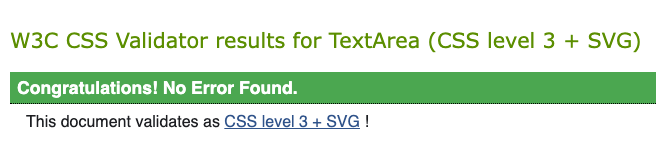
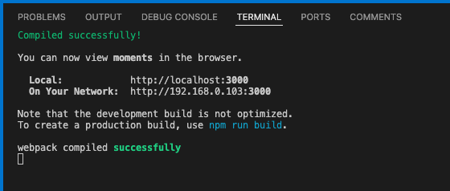
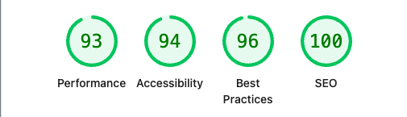

# Contents

- [CSS](#css)
- [ESlint](#eslint)
- [Lighthouse](#lighthouse)
- [User Stories](#user-stories)
- [Manual Testing](#manual-testing)
- [Bugs](#bugs)

## CSS

All files has been checked and gave no errors.

## ESlint

[ESlint](https://eslint.org/) - Has been used during developement and had no errors.

## Lighthouse

Lighthouse audits were conducted across all pages. Overall, the application performs well, with no major issues observed in dropdown menus or interactive elements. The Listings page is the only exception, where large user-uploaded images may impact performance.

## User Stories

| User story                                                                                                                                                  |     | PASS |
| ----------------------------------------------------------------------------------------------------------------------------------------------------------- | --- | ---- |
| As a user, I can see a navbar on all pages so that I can easily access different sections of the app.                                                       |     | ✔️   |
| As a user, I can navigate through pages quickly so that I can view content seamlessly without page refresh.                                                 |     | ✔️   |
| As a user, I can create a new account so that I can access all the features for signed-up users.                                                            |     | ✔️   |
| As a user, I can sign in to the app so that I can access functionality for logged-in users.                                                                 |     | ✔️   |
| As a user, I can tell if I am logged in or not so that I can log in if I need to.                                                                           |     | ✔️   |
| As a user, I can maintain my logged-in status until I choose to log out so that my user experience is not compromised.                                      |     | ✔️   |
| As a logged-out user, I can see sign-in and sign-up options so that I can sign in/sign up.                                                                  |     | ✔️   |
| As a user, I can view users' avatars so that I can easily identify users of the application.                                                                |     | ✔️   |
| As a logged-in user, I can create posts so that I can share my images with the world.                                                                       |     | ✔️   |
| As a user, I can view the details of a single post so that I can learn more about it.                                                                       |     | ✔️   |
| As a logged-in user, I can like a post so that I can show my support for the posts that interest me.                                                        |     | ✔️   |
| As a user, I can view all the most recent posts, and I can see them ordered by most recently created first so that I am up to date with the newest content. |     | ✔️   |
| As a user, I can search for posts with keywords so that I can find the posts and user profiles I am most interested in.                                     |     | ✔️   |
| As a logged-in user, I can view the posts I liked so that I can find the posts I enjoy the most.                                                            |     | ✔️   |
| As a logged-in user, I can view content filtered by users I follow so that I can keep up to date with what they are posting about.                          |     | ✔️   |
| As a user, I can scroll down to view more posts, and I can see new posts automatically load without clicking next page.                                     |     | ✔️   |
| As a user, I can view the posts page so that I can read the comments about the post.                                                                        |     | ✔️   |
| As a logged-in user, I can add comments to a post so that I can share my thoughts about the post.                                                           |     | ✔️   |
| As a user, I can see how long ago a comment was made, and I can understand how recent or old a comment is at a glance.                                      |     | ✔️   |
| As a user, I can read comments on posts so that I can read what other users think about the posts.                                                          |     | ✔️   |
| As an owner of a comment, I can delete my comment so that I can control removal of my comment from the application.                                         |     | ✔️   |
| As an owner of a comment, I can edit my comment so that I can fix or update my existing comment.                                                            |     | ✔️   |
| As a user, I can view other users' profiles so that I can see their posts and learn more about them.                                                        |     | ✔️   |
| As a user, I can see a list of the most followed profiles so that I can see which profiles are popular.                                                     |     | ✔️   |
| As a user, I can view statistics about a specific user so that I can learn more about them.                                                                 |     | ✔️   |
| As a logged in user, I can follow and unfollow other users so that I can see and remove posts by specific users in my posts feed.                           |     | ✔️   |
| As a user, I can view all the posts by a specific user so that I can catch up on their latest posts.                                                        |     | ✔️   |
| As a logged in user, I can edit my profile so that I can change my profile picture and bio.                                                                 |     | ✔️   |
| As a logged in user, I can update my username and password so that I can keep my profile secure.                                                            |     | ✔️   |
